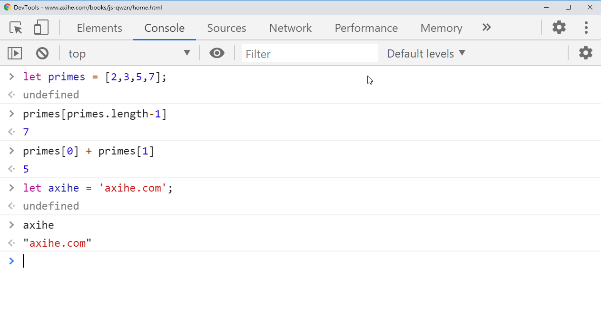

# 第1章: JavaScript简介

JavaScript是一门为Web网页而生的编程语言，基本上所有的网站都或多或少的使用了JavaScript这门语言，并且你现在使用的所有智能终端设备（PC电脑/平板/手机等），为了满足日常使用，基本都安装了网页浏览器，这些浏览器都内置了JavaScript的解释器；有了这些基础设备的支持，让JavaScript有了广泛的应用空间，也让JavaScript成为了目前世界上使用最广泛的编程语言，没有之一。除此以外，自从2009年Node.js的发布以后，让JavaScript拥有了脱离浏览器的运行能力，Node.js也深受广大开发者的喜爱，社区日益壮大，目前Node.js的生态已经很完善了；Node.js的成功也让JavaScript常用于后端开发。不过JavaScript本身也是一门令人诟病的语言，学习起来可能感觉很无厘头；但是这些都不是问题，无论你是从头开始学习的小白，还是对JavaScript理解不深入的开发者，这本书都会让你全面的掌握JavaScript这门语言。

如果你以前使用过其他面向对象语言，那么你在学习JavaScript的时候会事半功倍，也更容易理解JavaScript的原理。需要事先知道的是，JavaScript是一门弱类型语言，变量在声明的时候是无需指定类型的，变量的类型取决于后续给它赋予什么类型的值。如果你以前是使用Java或者C++等强类型语言，开始可能感觉没有规则，很不适应，但是别担心，你很快就会适应；如果你以前是没有任何基础的小白，也不需要忧虑，JavaScript很好学。

"JavaScript"的名字本身，可能会让你和Java产生误会；这是因为JavaScript创建之初，Java那会风头正盛，JavaScript创始人Brendan Eich为了蹭热度才起的这个名字，这在当时属于标题党。两者的关系类似"雷锋"和"雷峰塔"的关系，或者"老婆"和"老婆饼"的关系。目前JavaScript已经成为一种健壮高效的通用语言了，这些黑历史就没有必要深究了，我们学习技术才是硬道理。

<div style="border: 1px solid black; padding:10px; margin: 10px 0">
  <center><h2>JavaScript: 名字, 版本和模式<h2></center>
  <p>JavaScript 是 Netscape 创建的，至于历史演变没有什么好说的，这本书的使用的 ECMASctipt，是描述 JavaScript 这门语言的核心</p>
  <p>目前常说的JavaScript基础语法指的是2010年发布的第五版ECMASctipt，ECMASctipt简称ES，而ES5指的是第五版的ECMAScript，这本书基于ES5进行渐进式书写，自从2015年的ECMAScript 2015开始，ECMAScript每年都会发布一个release版本的规范，比如ECMASctipt 2016(ES6), ECMASctipt 2017(ES7)...</p>
  <p>虽然JavaScript早期的语法有很多缺陷，但是为了向后兼容，我们并不能粗暴的进行移除，为了解决这个问题，在ECMAScript2010这个版本开始引入严格模式的使用方式，详细可参考本书的第5.6.3节，那一节详细介绍了普通模式和严格模式的区别。从ES6开始，新的语法会隐式调用严格模式，比如你使用ES6的 class 创建类，则该类中的所有代码都自动使用严格模式进行解析，如果你在类的代码中使用以前有缺陷的语句，将不会被支持。本书会介绍以前老的JavaScript语法，但同时也会指出这些有缺陷的语句不能正常运行在严格模式中。</p>
</div>

为了满足日常使用，所有的语言都有自己的标准库及用于基本输入和输出的平台。JavaScript的核心部分定义了这本语言的使用规范以及处理数据的最小API，但是它并不包含输入和输出的功能。输入和输出工作交给了JavaScript的宿主环境进行处理。

最常见的JavaScript宿主环境就是我们使用的浏览器及Node.js；在浏览器中，用户对鼠标和键盘的操作可以转化为JavaScript的输入信息，浏览器还允许JavaScript基于这些输入信息发起Http请求或者别的输出操作，比如JavaScript可以借助HTML和CSS向用户的输出他的输入信息。

而Node.js可以让JavaScript拥有访问整个操作系统的权利，允许JavaScript程序读取和写入系统文件，通过网络发送和接受数据等等操作，Node.js可以轻松的实现一个WEB服务器，还可以通过写一些简单的代码来代替Shell脚本进行工作。

本书的大部分内容都是介绍JavaScript这门语言的本身，第11章介绍了JavaScript的标准库，第15章介绍了JavaScript的宿主环境浏览器，第16章介绍了JavaScript的宿主环境Node.js。

本书首先介绍了JavaScript的基础知识，然后在这些基础之上继续探讨了更高级的用法。阅读本章的时候，你可以根据自己的实际情况有选择的进行阅读。如果你已经是一名经验丰富的JavaScript程序员，阅读的时候跳过本章也是没有任何问题的，不过在跳过之前，推推荐你看一下本章的 `案例 1-1` 。

学习编程的时候，如果单纯的按照A, B, C, D, E这种顺序逐个学习，对掌握这们语言的帮助并不是很大，因为每一个模块都不是独立存在的，都会和其它模块相关联。所以本书在介绍某个模块时，会穿插必要的相关知识。

##  1.1 了解 JavaScript

当你跟着本书学习JavaScript时，请一定要动手试一下本书中的案例，然后进行修改，看它是不是按照你的预期进行工作，这么做可以加深你对JavaScript这门语言的理解（如果你能动手敲一遍本书中的案例，那就更好啦）。

为了能够正常的查看结果，你需要一个JavaScript的解释器。最简单的办法就是使用浏览器的开发者工具（使用 <kbd>F12</kbd>，<kbd>Ctrl</kbd>+<kbd>Shift</kbd>+<kbd>i</kbd> 或者 <kbd>Command</kbd>+<kbd>Option</kbd>+<kbd>i</kbd> 进行打开），并选中其中的 `console` 选项卡。然后就可以输入JavaScript代码了，输入完毕敲回车键，就可以看到代码的输出结果了。开发者工具通常显示在浏览器窗口的底部或者右侧，你可以根据自己的使用习惯进行调整，你甚至可以把它和浏览器分离开，作为单独的窗口进行使用 (如 `图 1-1` 中的展示)。

> TODO: 这张图很不清晰，可以考虑自己做一张相同的

<div style="border: 1px solid black; padding:10px; margin: 10px 0">
  
</div>

<i>图 1-1. 火狐浏览器的开发人员工具中JavaScript控制台</i>

另一种方式是从 `https://nodejs.org` 下载Node.js，在系统成功安装Nodejs以后，你只需要在终端里输入 `node` ，回车后就就可以得到一个交互式JavaScript对话框，在这Nodejs里属于REPL模块，类似浏览器的控制台。

``` bash
$ node
Welcome to Node.js v12.13.0.
Type ".help" for more information.
> .help
.break    Sometimes you get stuck, this gets you out
.clear    Alias for .break
.editor   Enter editor mode
.exit     Exit the repl
.help     Print this help message
.load     Load JS from a file into the REPL session
.save     Save all evaluated commands in this REPL session to a file

Press ^C to abort current expression, ^D to exit the repl 
> let x = 2, y = 3;
undefined
> x+ y
5
> (x === 2) && (y === 3)
true
> (x > 3) || (y < 3)
false
```

## 1.2 Hello World

当你准备正式学习JavaScript的时候，使用浏览器的开发者工具或Node.js的REPL交互环境，就非常不合适了，推荐使用编辑器进行写代码。你可以把JavaScript代码写在 `.js` 文件中，然后使用Node.js运行这个 `.js` 文件（写完JavaScript之后，请确保你的 `.js` 文件已经被保存）。或者把写好的代码复制到浏览器控制台或者Node.js REPL交互环境中去运行也是可以的。

``` 
$ node snippet.js
```

如果你使用上面这种方式运行 `.js` 文件。它不会像 **浏览器的开发者工具** 或 **Node.js的REPL交互环境** 那样自动打印你每一行代码的返回值。如果你需要输出这些信息，你可以使用 **console.log()**来输出你想要查看的值。

比如，你创建一个包含下面代码的 `hello.js` 文件。

``` js
console.log("Hello World!");
```

使用 `node hello.js` 运行该文件，你会看到终端里打印了 "Hello World!" 这条消息。

**注意**：当你运行 `node hello.js` 时，请确保你终端所在的目录和编辑器中文件所在的目录是一致的，否则可能会出现下面报错

``` bash
internal/modules/cjs/loader.js:968
  throw err;
  ^

Error: Cannot find module 'E:\SystemUserDir\Desktop\hello.js'
    at Function.Module._resolveFilename (internal/modules/cjs/loader.js:965:15)
    at Function.Module._load (internal/modules/cjs/loader.js:841:27)
    at Function.executeUserEntryPoint [as runMain] (internal/modules/run_main.js:71:12)
    at internal/main/run_main_module.js:17:47 {
  code: 'MODULE_NOT_FOUND',
  requireStack: []
}
```

**Windows电脑上终端的打开方式**：

1. 打开 `hello.js` 文件所在的目录
2. 按住Shift键后，在文件夹内点击鼠标右键
3. 点击菜单的 "在此处打开命令窗口"

如果你想要在浏览器中查看输出的信息，请在同一目录下创建 `hello.html` , 并把下面的代码写在新建的html文件中。

``` html
<script src="hello.js"></script>
```

然后打开浏览器，在电脑文件夹中找到新创建的 `hello.html` 文件，把文件直接拖到浏览器内即可。 

浏览器的地址栏出现类似下面的网址。

``` 
file:///Users/username/javascript/hello.html
或
file:///E:/file/010/hello.html
```

打开浏览器的开发者工具，选择 `Console` 选项卡，就可以看到输出的"Hello World!" 这条消息。

这个例子的配套源码下载，请移步译者的Github仓库

<https://github.com/anbang/javascript-the-definitive-guide-7th-edition>

## 1.3 JavaScript之旅

这一节通过例子让你快速预览下后面第二章和第三章的主要内容。这些内容后面会深入的进行探讨。**第2章**介绍了JavaScript注释，分号和Unicode字符集等内容。**第三章**开始真正的进入JavaScript的学习，主要介绍了JavaScript变量，以及可以分配哪些类型的值给变量。

下面是一个实例代码，用来介绍第二章和第三章的主要内容；

``` js
// 双斜杠后面的所有内容都是注释内容。
// 仔细阅读注释: 他们的作用是解释 JavaScript 代码。

// 变量是数据的代言人。
// 可以使用 let 关键字声明变量:

let x;              // 声明一个名字叫 x 的变量

// 可以通过 = 把值分配给变量
x = 0;              // 现在变量 x 被赋予 0 这个值
x                   // => 0: 变量 x 已经是0了

// JavaScript 支持多种类型的值
x = 1;              // 数字类型
x = 0.01;           // 数字类型可以是整数，也可以是小数
x = "hello world";  // 字符串类型，使用引号进行包裹
x = 'JavaScript';   // 使用单引号进行包裹，也是一个合法的字符串类型

// 学初中英语中，判断题通常让写 T 或 F。
// 这里的 T 和 F 表示中文的对和错
// T 代表 true ， F 代表 false
// 布尔值是计算机科学中的逻辑数据类型，
// 表示某件事情是否正确，只有 true 和 false 两种可能
x = true;           // 一个布尔值
x = false;          // 另外一个布尔值。

x = null;           // Null 是一个特殊值，表示"没有值"
x = undefined;      // Undefined 是另外一个特殊值，有点像 null.
```

在第6章和第7章，会重点介绍JavaScript的两个非常重要的数据类型: 对象和数组。因为它们在JavaScript中的地位太重要了，在你没有读到那一章之前，你会经常看到它，所以这里也顺便介绍下对象和数组。

``` js
// 对象是JavaScript中最重要的数据类型。
// 对象一个 key/value 结构的集合。
// 它的产生可以直接创建出来，也可以由特定的字符串解析而来
let book = {                // 对象是用一对花括号括起来的值
    topic: "JavaScript",    // 属性 "topic" 拥有字符串 "JavaScript" 这个值
    edition: 7              // 属性 "edition" 拥有 数字 7 这个值
};                          // 记得对象是一对花括号，记得用 } 来结束

// 访问对象的熟悉，使用 . 或者 []:
book.topic                  // => "JavaScript"
book["edition"]             // => 7: 访问属性值的另一种方法

book.author = "Flanagan";   // 给对象创建新的属性
book.contents = {};         // {} 是没有属性值的空对象，但它也是合法的对象类型

// 使用可选链操作符 ?. 访问对象属性 
// ES2020的新语法，该语法于2020年8月3日进入规范的第四阶段
book.contents?.ch01?.sect1  // => undefined: book.contents 中没有 ch01 的属性

// JavaScript 还支持数组类型 (一个有序的元素序列) 
let primes = [2, 3, 5, 7];  // 拥有4个值的数组，使用 [ 和 ] 进行包裹
primes[0]                   // => 2: 数组的第一个元素 (注意：数组第一个元素的索引是 0 而不是 1 )
primes.length               // => 4: 查询这个数组当前有多少个元素
primes[primes.length - 1]   // => 7: 获取数组最后一个元素(因为索引是以0开始，而不是1)

primes[4] = 9;              // 给数组添加一个新元素
primes[4] = 11;             // 更改数组的原有元素

let empty = [];             // [] 是一个没有任何元素的空数组
empty.length                // => 0

// 数组和对象的内部，还可以拥有其他的数组和对象
let points = [              // 拥有2个元素的数组
    {
        x: 0,
        y: 0
    },                      // 每个元素都是一个对象
    {
        x: 1,
        y: 1
    }
];
let data = {                // 拥有两个属性的对象
    trial1: [
        [1, 2],
        [3, 4]
    ],                      // 每一个属性的值都是一个数组
    trial2: [
        [2, 3],
        [4, 5]
    ]                       // 数组内还包含了数组
};
```

<div style="border: 1px solid black; padding:10px; margin: 10px 0">
  <center><h2>示例代码中的注释<h2></center>
  <p>你可能已经在上面代码中看到了以箭头 <code>=> </code>开头的注释，箭头之后的值表示注释之前的代码结果。这是模拟浏览器中开发者工具的Console的交互结果</p>
  <p>另外 // => 这种注释也是作者用来做断言使用的，方法是编写一个工具用来测试代码并验证它的结果是否等于 // = 之后的值，作者通过这种方式可以大大减少这本书中的错误，这种断言的思路还是非常值得学习的。</p>
  <p>除了上面这种断言方式，作者还使用了下面两种断言方法，你在本书的后面会大量看到</p>
  <p>两种相关的，用来做断言的注释：</p>
  <ul>
    <li>如果你看到注释为 <code>// a == 42 </code>，则表示注释之前的代码运行之后，变量a的值为42。</li>
    <li>如果你看到 <code>// ! </code> 这种注释，则表示注释之前的行的代码会引起执行异常，而感叹号之后的其余注释，会说明引起这种异常的原因。</li>
  </ul>
</div>

上面代码中所示的，用来创建数组的 `[]` 符号 , 和创建对象中的 `{}` ,这些语法被称为初始化表达式；这些相关的内容会在第四章详细介绍。比如获取对象的属性和数组元素的`.`  和 `[]` ，这也是一个表达式。

在JavaScript中，最常见的表达式是操作符。

``` js
// 对值使用运算符，会返回一个新的值
// 先介绍一下比较简单的算术运算符
3 + 2                       // => 5: 加法运算
3 - 2                       // => 1: 减法运算
3 * 2                       // => 6: 乘法运算
3 / 2                       // => 1.5: 除法运算
points[1].x - points[0].x   // => 1: 也可以用在变量或者属性的操作
"3" + "2"                   // => "32": 字符串形式的数字使用 + 号, 
                            // 作用是连接成新的字符串

// JavaScript 定义了一些简写的运算符用法
let count = 0;              // 定义了一个变量
count ++;                   // 变量自增
count --;                   // 变量自减
count += 2;                 // 变量本身加2: 类似 count = count + 2;
count *= 3;                 // 变量本身乘3: 类似 count = count * 3;
count                       // => 6: 变量名本身也是一个表达式

// 关系运算符用来判断两个值之间的关系
// 不等于，小于，小于等于，大于，大于等于等...
// 关系运算符返回一个布尔值。
let x = 2,
    y = 3;              // 符号 = 是用来赋值的，不是用来判断y是否等于3的
x === y                 // => false: 判断两个值相同
x !== y                 // => true: 判断两个值不相同
x < y                   // => true: 判断左边的值 小于 右边
x <= y                  // => true: 判断左边的值 小于 等于右边
x > y                   // => false: 判断左边的值 大于 右边的值
x >= y                  // => false: 判断左边的值 大于等于 右边的值
"two" === "three"       // => false: 两个字符串不相同
"two" > "three"         // => true: 左右两边的第一个字母't"相等，
                        // 但是第二个字符开始，"w" 大于 "h"，后面的字符就不再进行比较
false === (x > y)       // => true: 左右两边先运算，然后再判断，两边都是false

// 运算符的组合使用
(x === 2) && (y === 3)  // => true: && 用来判断两边的值都是true 
                        // &&类似中文并且的意思，需要两边同时满足条件。
(x > 3) || (y < 3)      // => false: || 用来判断两边的值至少有一个为true 
                        // || 类似中文或者的意思，两边有一个值为true就属于符合条件。

// 取反操作
!(x === y)              // => true: ! 是把后面的值转成布尔值后取反
```

如果把JavaScript的表达式比作是短语，那么语句就是一个完整的句子。在第五章的时候会重点介绍语句。表达式可以用来计算值但是它并不会改变原有的值。而语句本身没有值，但是它会改变值，比如上面的变量声明和赋值操作；其中有一类叫做控制语句的非常重要，比如循环，判断等。

函数是一个可以生成独立空间并且接受参数的代码块，定义之后，可以复用。这在第八章的时候会重点的介绍。在你看到第八章之前，你会经常看到它，所以这里放一些简单的例子，先简单了解一下；

``` js
let y = 3;
// 函数在调用的时候可以接受参数
function plus1(x) {     // 定义一个接受参数x的函数 plus1
    return x + 1;       // 把传入的参数加1后，返回出去
}                       // 函数的语法使用一对花括号进行包裹 
plus1(y)                // => 4: y 在上面赋值了 3, plus1 会返回3+1，所以结果是4

let square = function(x) { 
    // return 之后的内容是函数对外的返回值，
    // 该返回值可以赋值给其他变量
    return x * x;       // 计算变量的值
};  // 分号用来表示一条语句结束（注: 虽然分号可以省略，但是推荐养成写分号的习惯）
square(plus1(y))        // => 16: 同时调用两个函数
```

上面是通用的函数写法，在ES6的规范中，提出了箭头函数的语法 ，通过 `=>` 符号来连接 **函数的参数** 与 **函数的主体** 。如果你打算写一个匿名函数，那么使用箭头函数的会非常的简洁和方便。

把上面的函数，用ES6的语法写一遍，代码如下: 

``` js
let y = 3;
const plus1 = x => x + 1;   // 函数的参数是 x , 返回值是 x + 1
const square = x => x * x;  // 函数的参数是 x , 返回值是 x * x
plus1(y)                    // => 4: 功能上和上面的 plus1 函数一模一样
square(plus1(y))            // => 16
```

除了我们定义的函数以外，我们还可以使用对象上的方法，比如下面例子中的代码:

> 注: 如果一个函数是挂在某个对象上的，通常把这类函数叫做"方法"；比如某个对象上有一个 `push` 函数，通常也会以 "push方法" 来称呼它。

``` js
// 所有数组类型的数据，都天生具有下面的方法
let a = [];  // 创建一个空数组
a.push(1, 2, 3); //  这里的 push() 方法的作用是将元素添加到数组中
a.reverse(); // reverse 方法是将数组内的元素进行倒叙操作

// 我们也可以自定义一个方法，下面代码里的this指的是对象 points 本身
let points = [              // 拥有2个元素的数组
    {
        x: 0,
        y: 0
    },                      // 每个元素都是一个对象
    {
        x: 1,
        y: 1
    }
];
points.dist = function() { // 定义一个两点之间距离的方法
    let p1 = this[0]; // 第一个元素
    let p2 = this[1]; // 第二个元素
    let a = p2.x - p1.x; // 亮点之间的x坐标差值
    let b = p2.y - p1.y; // 亮点之间的y坐标差值

    // Math.sqrt()用来处理平方根
    return Math.sqrt(a * a + b * b);// 使用勾股定理来计算
};
points.dist() // => Math.sqrt(2): 两点之间的距离
```


> this关键字比较重要，后面会详细进行介绍，总结成一句话就是: **谁调用了该函数，那么该函数内的this就指向谁**；这里的 dist 函数是 `points` 使用`points.dist()`调用的，`dist` 内的this就指向 `points`;


下面介绍JavaScript中常见的流程控制语句:

``` js
// JavaScript 的判断和循环语句，类似 C, C++, Java 等其他语言.
// 如果你有其他面向对象语言的基础，你学起来会事半功倍
function abs(x) {   // 写一个计算绝对值的方法
    if (x >= 0) {   // if语句;表示如果满足什么条件，则执行{}内的操作
        // 把x的值返回出去，并终止函数的执行
        return x;   // 如果参数 x 的值大于等于0，则执行这行代码；
    } // if语句的主体使用{}进行包裹，}表示语句的结束位置
    else {          // 如果不满足上面的if判断条件,则执行下面else里面的代码;
        return -x;  // 对数值进行取反；注意负号和上面布尔取反的感叹号 ! 之间有区别的。 
    } // else 是对上面if的补充，它是非必需的，你可以只写 if 语句而不写 else 语句
} // 注意，这个函数内的return都是写在 if / else 内的

abs(-10) === abs(10)        // => true

function sum(array) {       // 计算数组内的所有元素的总和
    let sum = 0;            // 定义一个变量sum用来储存所有元素的总和，初始时候赋值为 0
    for (let x of array) {  // 遍历参数中的数组，每次都把目标元素赋值给变量 x 
        // 这条语句类似 sum = sum + x ; 
        sum += x;           // 把每次遍历的元素，累加到变量sum上
    }                       // 循环结束
    return sum;             // 把变量sum的值返回出去
}
let primes = [2, 3, 5, 7, 11];
sum(primes) // => 28: 函数sum，计算数组 primes 内 5 个元素之和 2+3+5+7+11

// 要理解下面这个函数，可以先了解一下数学中的阶乘概念
function factorial(n) {     // 计算一个正整数阶乘的函数
    let product = 1;        // 以1作为阶乘的开始
    while (n > 1) {         // 只要满足参数 n 大于 1 的条件，会持续执行花括号 {} 内的代码
        product *= n;       // 等价于 product = product * n;
        // 使用 while 循环的时候，一定要控制好条件，否则会出现死循环，导致程序卡死的现象
        n--;                // 等价于 n = n - 1;
    }                       // while循环结束
    return product;         // 返回最后的阶乘结果
}
factorial(4) // => 24: 1*4*3*2

// 另外一种阶乘的写法
// 这种写法里的for循环，省略了花括号 {}，虽然这种写法是合法的，但是非常不推荐
function factorial2(n) {       
    let i, product = 1;         // 以1作为阶乘的开始，并额外声明一个变量 i
    for (i = 2; i <= n; i++)    // i用来控制条件，并在初始的时候赋值2
        product *= i;           // 注意省略{}的情况下的代码缩进
    return product;             // 返回最后的阶乘结果
}
factorial2(5)                   // => 120: 1*2*3*4*5
```

JavaScript 支持面向对象的编程风格，但是它与传统的面向对象语言还是有很大差异的。在后面第九章的那里，会使用大量的例子来详细介绍JavaScript中的面向对象编程方法。下面是一个非常简单的小例子，演示了在JavaScript中使用类来表示坐标的 x 轴和 y 轴。并且在这个类上还定义了一个 `distance` 方法，这个方法用来计算某一个点到坐标原点的距离。

```js
class Point {               // 所有语言的惯例，写类名的时候，首字母需要大写
    constructor(x, y) {     // constructor 函数用来初始化新的实例
        this.x = x;         // 初始化对象
        this.y = y;         // 将传入的参数初始化为一个对象
    }                       // 在构造函数内不需要 return

    // 逻辑和上面points.dist一样的
    distance() {            // 计算某一个点到坐标原点的距离
        return Math.sqrt(   
        this.x * this.x +   // this 指向 Point 的实例
        this.y * this.y     
    }
}

// 使用 new 关键字来创建构造函数 Point()，返回值是一个对象
let p = new Point(1, 1);    // 传入参数 (1, 1)用来初始化坐标点

// p 是 Point 的实例，调用上面的 distance 方法
p.distance()                // => 进行勾股定理的运算
``` 

JavaScript基本语法的预览，到这里就算结束了，后面还有一些独立模块的内容，这里也介绍一下。

_第十章, 模块_

“模块”是指将功能拆分成独立的、可复用的单独脚本或文件，一般会借助函数和类来完成。

_第十一章, JavaScript 标准库_

涵盖了JavaScript所有的内置函数和类，比如包含了Map和Set等重要的数据结构。

_第十二章, 迭代器和生成器_

介绍 for/of 的工作方式，以及如何用它进行迭代。同时包含了generator函数和yield语句。

_第十三章, JavaScript异步_

介绍了 JavaScript 的异步编程，涵盖了回调函数和事件，基于Promise的API，以及 async 和 await 的用法。虽然JavaScript本身不是异步语言，但是浏览器事件和Node.js的API都是默认异步的，本章主要介绍了这些API的使用。

_第十四章, Metaprogramming_

引入了很多JavaScript的高级功能，如果你是打算自己进行JavaScript库的封装，这一章不容错过！

_第十五章, 浏览器中的JavaScript_

浏览器是JavaScript的常见宿主环境，本章详细阐述了浏览器是如何进行 JavaScript 的代码解析，并涵盖浏览器中很多重要的API，本书中花了大量的笔墨来介绍这些内容。

_第十六章, Node.js中的JavaScript_

Node.js 也是JavaScript的常见宿主环境，本章涵盖了 Node.js 常用的 API 以及数据结构等信息。

_第十七章, JavaScript工具和扩展_

涵盖了很多已经广泛应用，并且值得深入研究的工具和语言扩展，借助这些工具和扩展，可以让你写代码的效率如虎添翼。

## 1.4 案例: 统计字母出现的频率并以直方图显示

这一节介绍一个很简洁的例子，下面`案例 1-1`中一个基于　Node.js　的代码，主要功能是读取文本，统计出现的字母以及字母出现频率，并以直方图的形式展现出来。你可以用这个例子来分析代码本身的字母出现频率。

```bash
$ node charfreq.js < charfreq.js
T: ########### 11.22%
E: ########## 10.15%
R: ####### 6.68%
S: ###### 6.44%
A: ###### 6.16%
N: ###### 5.81%
O: ##### 5.45%
I: ##### 4.54%
H: #### 4.07%
C: ### 3.36%
L: ### 3.20%
U: ### 3.08%
/: ### 2.88%
```

这个例子你现在只需要了解一下就可以了，不要求全部搞懂，因为这里面使用了很多JavaScript的高级语法。通过后面章节的不断学习，你要确保全部理解示例中的代码。

_案例 1-1. 使用JavaScript统计字母的频率直方图_

```js
/**
 * 这段 Node.js 代码是以标准输入的形式读取文本，计算文本中每一个字母的出现频率
 * 并以直方图的形式展示出来；下面这段代码需要 Node.js 12 及以上。
 * 
 * 在 Unix 风格的系统中（Linux 和 Mac ），你可以用下面的方式调用is:
 *    node charfreq.js < corpus.txt
 */

// DefaultMap 是基于 Map 的类，这种方式可以让你在调用不存在的属性时不会返会 null
class DefaultMap extends Map {
    constructor(defaultValue) {
        super();                            // 调用超类构造函数
        this.defaultValue = defaultValue;   // 将输入的值挂在实例的 defaultValue 属性上
    }
    get(key) {
        if (this.has(key)) {                // 如果要查询的属性已经在是实例上
            return super.get(key);          // 通过超类返回对于的属性值
        }
        else {
            return this.defaultValue;       // 否则返回默认值
        }
    }
}

// 这个类用来计算并显示字母的直方图
class Histogram { 
    constructor() {
        this.letterCounts = new DefaultMap(0);  // 计算字母的出现次数
        this.totalLetters = 0;                  // 记录出现多少了字母
    }

    // 这个方法根据文本中的字母来更新直方图
    add(text) {
        // 删除空格，然后转为大写字母
        text = text.replace(/\s/g, "").toUpperCase();

        // 循环遍历文本的字母
        for(let character of text) {
            let count = this.letterCounts.get(character);   // 获取上次计数
            this.letterCounts.set(character, count+1);      // 在原有计数的基础上加1
            this.totalLetters++;
        }
    }
    
    // 将直方图转换为 ASCII 的字符串
    toString() {
        // 将Map结构转换为 [key,value] 数组形式的数组 （数组内套数组）
        let entries = [...this.letterCounts];

        // 通过计数来排序，然后按字母顺序
        entries.sort((a,b) => {                 // 排序函数
            if (a[1] === b[1]) {                // 如果两个字母的出现频率一样
                return a[0] < b[0] ? -1 : 1;    // 按照字母的顺序返回.
            }else{                              // 如果出现频率不一样
                return b[1] - a[1];             // 返回出现频率高的值
            }
        });

        // 将计数转化成百分比
        for(let entry of entries) {
            entry[1] = entry[1] / this.totalLetters*100;
        }

        // 删除所有占比小于1%的数据
        entries = entries.filter(entry => entry[1] >= 1);
        
        // 转成一行文本
        let lines = entries.map(
            ([l,n]) => `${l}: ${"#".repeat(Math.round(n))} ${n.toFixed(2)}%`
        );

        // 使用换行符拼成字符串输出
        return lines.join("\n"); 
    }
}

// 创建直方图的异步函数，使用数据流的方式读取文本，数据流读取完毕后，返回最终的直方图。
async function histogramFromStdin() {
    process.stdin.setEncoding("utf-8"); // 读取 Unicode 字符串, 而不是字节
    let histogram = new Histogram();
    for await (let chunk of process.stdin) {
        histogram.add(chunk);
    }
    return histogram; 
}

// 这个脚本的入口，通过标准输入创建一个直方图对象，然后把它转成字符串输出
histogramFromStdin().then(histogram => { console.log(histogram.toString()); });
```

# 1.5 小结

这一章带大家简单认识了 JavaScript 的基本用法，比如注释，操作符，变量，数据类型，语句，对象，函数等。如果你现在看不懂这些代码，不要感到焦虑，这是很正常的现象；因为这一章只是带你简单的进行语法的预览，上面这些知识在后面章节都会详细的进行介绍。有些知识点会介绍的非常深入和广泛，那时候你可能会有点反感，但是如果你想要深入的理解并掌握JavaScript，这些细节都是非常有必要了解的。认真学完这本书的知识以后，你再回头看一些流行框架的源码，你会很容易的就看懂。

在后续章节的阅读中，如果你卡在某一个知识点里，感觉非常难以理解。建议你直接跳过它，继续阅读别的章节，等看完本书以后再回头来研究当初的难点。没有必要在一个"死胡同"里浪费大量时间，也许等你的知识面丰富以后，站在更高的角度来看当初的难题，可能就直接理解了。