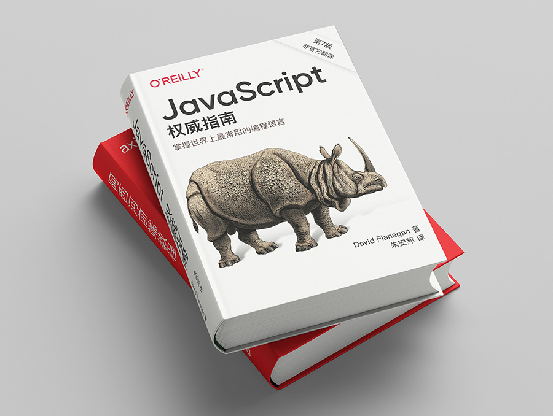

# JavaScript权威指南(第7版)-非官方翻译

这本书的英文名字叫: JavaScript: The Definitive Guide: Master the World's Most-Used Programming Language (Inglés) 7th

目前amazon已经上架了，购买链接:  [JavaScript: The Definitive Guide](https://www.amazon.com/-/zh/JavaScript-Definitive-Most-Used-Programming-Language-dp-1491952024/dp/1491952024/)

这是一本非官方翻译的项目；

开始于: 2020年8月18日

翻译人: 朱安邦

现在Github上翻译出来，后续会整理成册放在我的个人网站 [阿西河前端教程](https://www.axihe.com/books/js-qwzn/home.html) 上

## 关于

这本书打算每天下班后进行翻译，所以可能效率没有那么的快；欢迎一起翻译。

## 参与翻译工作的人

- 朱安邦

## 版权许可

The MIT License